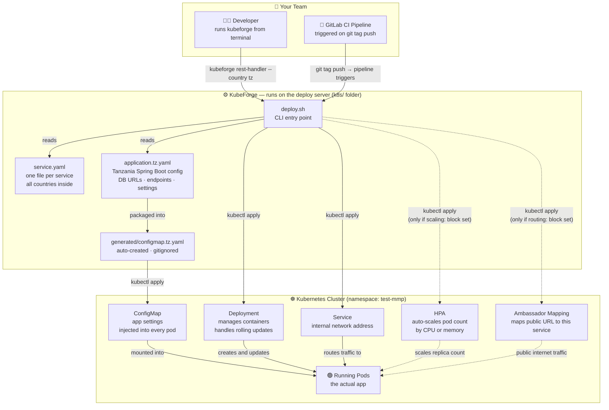
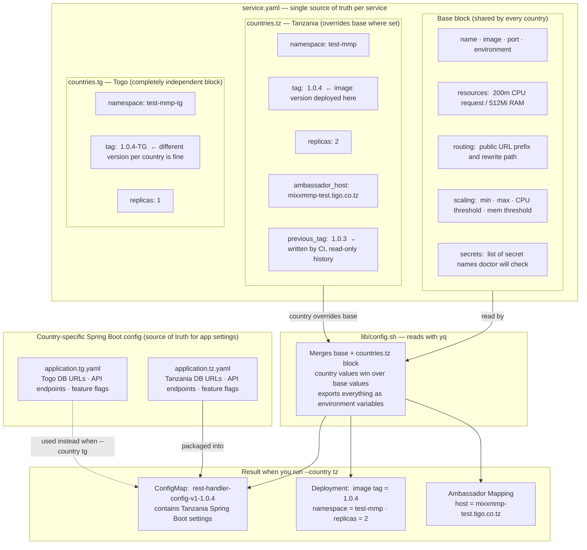
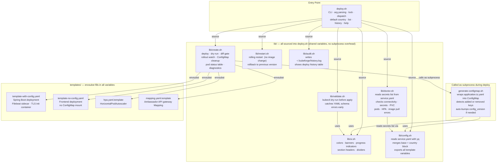

# KubeForge

> **Multi-country Kubernetes deployment engine for microservice platforms**

A production-grade bash-based deployment CLI built for teams managing the same microservice stack across multiple regional deployments (countries, regions, environments). KubeForge replaces ad-hoc `kubectl apply` commands with a structured, auditable, CI/CD-friendly workflow that handles ConfigMap versioning, rolling updates, automatic rollback, and multi-country config — all from a single `service.yaml` per service.

```
██╗  ██╗██╗   ██╗██████╗ ███████╗███████╗ ██████╗ ██████╗   ██████╗ ███████╗
██║ ██╔╝██║   ██║██╔══██╗██╔════╝██╔════╝██╔═══██╗██╔══██╗ ██╔════╝ ██╔════╝
█████╔╝ ██║   ██║██████╔╝█████╗  █████╗  ██║   ██║██████╔╝ ██║  ███╗█████╗
██╔═██╗ ██║   ██║██╔══██╗██╔══╝  ██╔══╝  ██║   ██║██╔══██╗ ██║   ██║██╔══╝
██║  ██╗╚██████╔╝██║  ██║███████╗██║     ╚██████╔╝██║  ██║ ╚██████╔╝███████╗
╚═╝  ╚═╝ ╚═════╝ ╚═╝  ╚═╝╚══════╝╚═╝      ╚═════╝ ╚═╝  ╚═╝  ╚═════╝ ╚══════╝
```

---

## Table of Contents

- [Features](#features)
- [Architecture](#architecture)
- [Visual Architecture](#visual-architecture)
- [Prerequisites](#prerequisites)
- [Installation](#installation)
- [Quick Start](#quick-start)
- [service.yaml Reference](#serviceyaml-reference)
- [Multi-Country Deployment](#multi-country-deployment)
- [Default Country](#default-country)
- [Command Reference](#command-reference)
- [Deployment Flow](#deployment-flow)
- [Pre-Deploy Diff](#pre-deploy-diff)
- [Doctor Diagnostics](#doctor-diagnostics)
- [ConfigMap Versioning](#configmap-versioning)
- [CI/CD Integration](#cicd-integration)
- [Audit Log](#audit-log)
- [Troubleshooting](#troubleshooting)
- [Design Decisions](#design-decisions)

---

## Features

| Feature | Description |
|---------|-------------|
| **Single `service.yaml` per service** | All countries, resources, routing, and HPA in one file — no more scattered env files. |
| **Multi-country deployments** | Each service has a `countries:` section. Deploy to any country with `--country <code>`. |
| **Default country** | Set once with `kubeforge default tz` — then just `kubeforge <service>` deploys to it. |
| **ConfigMap versioning** | Auto-generated, tagged names (`service-config-v2-1.0.22-tz`). Keeps newest 3, deletes older. |
| **Zero-downtime rolling updates** | `maxSurge: 1 / maxUnavailable: 0` — new pod starts before old one stops. |
| **Automatic rollback** | Rollout timeout triggers instant `kubectl rollout undo` with diagnostics. |
| **Pre-flight validation** | `kubectl --dry-run=client` validates all YAML before anything is applied. |
| **Pre-deploy diff** | `kubectl diff` before every apply — shows exactly what changes with colored output. Must confirm before apply. |
| **Doctor diagnostics** | `kubeforge doctor` checks connectivity, secrets, ConfigMaps, PVC, pods, and image pull errors in one command. |
| **Country scaffolding** | `--init` creates `service.yaml` skeleton + `application.<country>.yaml` from base templates. |
| **Audit trail** | Every deploy/restart/rollback logged to `~/.kubeforge/history.log`. |
| **Dry-run preview** | Full rendered YAML shown without applying — useful for code review. |
| **Status dashboard** | Live pods, deployment wide, service, HPA in one command. |
| **CI-aware** | `CI=true` disables all interactive prompts for pipeline use. |
| **GitLab CI integration** | Country-gated jobs — only the matching country job runs per pipeline. |
| **HPA support** | Dual CPU + memory autoscaling with banking-grade conservative scale-down. |
| **Ambassador mapping** | Auto-generated `Mapping` resource for API gateway routing. |
| **ELK logging** | Filebeat sidecar injected into every deployment automatically. |
| **TLS trust injection** | Init container imports TLS certificate into JVM truststore at startup. |

---

## Architecture

### Repository Layout

```
k8s/
├── deploy.sh                     # Entry point — thin orchestrator
├── generate-configmap.sh         # Standalone ConfigMap generator
├── gitlab-ci-deploy.yml          # GitLab CI deploy stage (drop-in)
│
├── lib/
│   ├── ui.sh                     # Terminal styling, banners, step indicators
│   ├── config.sh                 # service.yaml / values.env loader (exports all vars)
│   ├── create.sh                 # deploy, dry-run, status, init, rollout watch, diff
│   ├── restart.sh                # restart, rollback actions
│   ├── validate.sh               # Pre-flight YAML validation
│   ├── audit.sh                  # Audit log and history display
│   └── doctor.sh                 # Namespace-scoped health checks
│
├── templates/
│   ├── template-with-config.yaml # Spring Boot deployment (with ConfigMap)
│   ├── template-no-config.yaml   # Frontend/GUI deployment (no ConfigMap)
│   ├── hpa.yaml.template         # HorizontalPodAutoscaler
│   └── mapping.yaml.template     # Ambassador API gateway Mapping
│
└── services/
    └── <service-name>/
        ├── service.yaml              ← single config file (all countries)
        ├── application.tz.yaml       ← Tanzania Spring Boot config
        ├── application.tg.yaml       ← Togo Spring Boot config
        └── generated/                ← gitignored, auto-created on deploy
            ├── configmap.tz.yaml
            └── configmap.tg.yaml
```

### Module Dependency Graph

```
deploy.sh
  ├── lib/ui.sh          (sourced — colors, banners, step indicators)
  ├── lib/config.sh      (sourced — load_service_config, write_configmap_full_name)
  ├── lib/validate.sh    (sourced — pre-flight kubectl dry-run)
  ├── lib/restart.sh     (sourced — do_restart, do_rollback)
  ├── lib/create.sh      (sourced — do_deploy, do_dry_run, do_status, do_init, show_diff)
  ├── lib/audit.sh       (sourced — log_audit, do_history)
  ├── lib/doctor.sh      (sourced — do_doctor, namespace/service health checks)
  │
  └── generate-configmap.sh   (called as subprocess during deploy)
```

All library modules are **sourced** (not subshells), so all variables are shared across functions without disk round-trips.

### Config Loading Strategy

```
service.yaml  (single file per service)
  └── base keys: name, image, port, environment, resources, routing, scaling
  └── countries.tz: namespace, tag, replicas, ambassador_host, host_alias_ip
  └── countries.tg: namespace, tag, ...
        ↓
  lib/config.sh → _load_yaml() → exports all variables
        ↓
  envsubst → rendered YAML → kubectl apply
```

Country-level values override base-level values (replicas, resources). Everything not set per-country inherits from the base.

---

## Visual Architecture

### 1 — System Overview

> What KubeForge is and what it connects to.



---

### 2 — Deploy Flow

> Exactly what happens, step by step, when you run `kubeforge rest-handler --country tz`.

```mermaid
flowchart TD
    START(["▶  kubeforge rest-handler --country tz"])

    A["📖  Read service.yaml<br/>extract: image · port · tag<br/>namespace · resources · routing"]

    LOCK["🔒  Acquire deploy lock<br/>prevents two deploys of the same<br/>service + country running at once"]

    TMPL{"Does application.tz.yaml exist?"}
    WITH["Use  template-with-config.yaml<br/>Spring Boot deployment + ConfigMap"]
    WITHOUT["Use  template-no-config.yaml<br/>Frontend — no ConfigMap needed"]

    PRE["✅  Pre-flight validation<br/>kubectl dry-run on all YAML<br/>catches errors before anything<br/>touches the live cluster"]

    V{"All valid?"}
    FAIL1(["❌  Stop — fix errors first"])

    GEN["📦  Generate ConfigMap<br/>wrap application.tz.yaml into<br/>a versioned Kubernetes ConfigMap"]

    K{"Did config keys<br/>add or remove?"}
    BUMP["⬆  Auto-bump config_version<br/>e.g.  v1 → v2<br/>recompute ConfigMap name<br/>write back to service.yaml"]
    SAME["Keep config_version<br/>only values changed — no bump needed"]

    DIFF["👁  Show diff<br/>exactly what will change<br/>in the live cluster — colorized"]

    MODE{"Running in CI<br/>or local terminal?"}
    CONFIRM{"You type  yes ?"}
    AUTO["CI auto-confirms<br/>no human needed"]
    CANCEL(["⊘  Cancelled — cluster untouched"])

    APPLY["🚀  Apply to cluster<br/>① ConfigMap<br/>② Ambassador Mapping  (if routing set)<br/>③ Deployment + Service<br/>④ HPA  (if scaling set)"]

    WATCH["👀  Watch rollout<br/>wait for new pods to pass<br/>readiness checks<br/>auto-warn at 25% of timeout"]

    H{"Pods healthy<br/>within timeout?"}

    RB["↩  Auto-rollback<br/>kubectl rollout undo<br/>show pod events + logs"]
    FAIL2(["❌  FAILED — previous version restored automatically"])

    OK["✅  SUCCESS<br/>show live pod table<br/>clean up old ConfigMaps keep newest 3<br/>write audit log entry"]
    LIVE(["🟢  Service is live"])

    START --> A --> LOCK --> TMPL
    TMPL -->|"yes"| WITH --> PRE
    TMPL -->|"no"| WITHOUT --> PRE
    PRE --> V
    V -->|"no"| FAIL1
    V -->|"yes"| GEN --> K
    K -->|"yes — keys added or removed"| BUMP --> DIFF
    K -->|"no — values only"| SAME --> DIFF
    DIFF --> MODE
    MODE -->|"CI=true"| AUTO --> APPLY
    MODE -->|"local terminal"| CONFIRM
    CONFIRM -->|"no"| CANCEL
    CONFIRM -->|"yes"| APPLY
    APPLY --> WATCH --> H
    H -->|"no — timed out"| RB --> FAIL2
    H -->|"yes"| OK --> LIVE
```



---

### 3 — Config Merge Strategy

> How one `service.yaml` file drives deployments to multiple countries.



---

### 4 — Code Modules

> How the codebase is structured internally.



---

## Prerequisites

### Tools (on the deploy host)

| Tool | Purpose | Required |
|------|---------|----------|
| `kubectl` | Apply resources, watch rollouts | Yes |
| `yq` (mikefarah v4) | Parse `service.yaml` | Yes |
| `bash` 4.x+ | Script runtime | Yes |
| `envsubst` (gettext) | Template variable substitution | Yes |
| `sed`, `awk`, `grep` | Config processing | Yes |
| `colordiff` | Colored ConfigMap diff | No (falls back to `diff`) |
| `yamllint` | YAML syntax fallback if kubectl unavailable | No |

Install tools on RHEL/CentOS:
```bash
sudo dnf install -y gettext colordiff

# Install yq (mikefarah v4)
sudo wget -qO /usr/local/bin/yq \
  https://github.com/mikefarah/yq/releases/latest/download/yq_linux_amd64
sudo chmod +x /usr/local/bin/yq
```

Install on Ubuntu/Debian:
```bash
sudo apt install -y gettext-base colordiff

sudo wget -qO /usr/local/bin/yq \
  https://github.com/mikefarah/yq/releases/latest/download/yq_linux_amd64
sudo chmod +x /usr/local/bin/yq
```

### Kubernetes Cluster Prerequisites

The following resources must exist in your target namespace **before** the first deploy. KubeForge does not create these — they are managed separately.

#### Secrets

```bash
# Application credentials (injected into every Spring Boot container via envFrom)
kubectl create secret generic <app-secrets-name> \
  --from-env-file=application-secrets.env \
  -n <your-namespace>

# Container registry pull credentials
kubectl create secret docker-registry <registry-secret-name> \
  --docker-server=<your-registry> \
  --docker-username=<user> \
  --docker-password=<password> \
  -n <your-namespace>

# TLS certificate (mounted into init container + app containers)
kubectl create secret generic <tls-secret-name> \
  --from-file=fullchain.crt=<path-to-cert> \
  -n <your-namespace>

# ELK/Elasticsearch credentials (used by Filebeat sidecar)
kubectl create secret generic <elk-secret-name> \
  --from-literal=ELK_USERNAME=<user> \
  --from-literal=ELK_PASSWORD=<pass> \
  -n <your-namespace>
```

#### Shared ConfigMaps

```bash
# Logback XML config (mounted into every Spring Boot service)
kubectl create configmap shared-logback \
  --from-file=logback.xml=<path-to-logback.xml> \
  -n <your-namespace>

# Filebeat config (mounted into every Filebeat sidecar)
kubectl create configmap shared-filebeat-config \
  --from-file=filebeat.yml=<path-to-filebeat.yml> \
  -n <your-namespace>
```

#### PersistentVolumeClaim

```bash
kubectl apply -f - <<EOF
apiVersion: v1
kind: PersistentVolumeClaim
metadata:
  name: file-storage
  namespace: <your-namespace>
spec:
  accessModes: [ReadWriteOnce]
  resources:
    requests:
      storage: 10Gi
EOF
```

#### Other Requirements
- Ambassador / Emissary-Ingress CRDs installed (for `Mapping` resources)
- Target namespace must exist: `kubectl create namespace <your-namespace>`
- `kubectl` context must point at the correct cluster before running

---

## Installation

### 1. Clone the repository

```bash
git clone <your-repo-url> ~/k8s
cd ~/k8s
chmod +x deploy.sh generate-configmap.sh
```

### 2. Make `kubeforge` available system-wide

```bash
# Create a symlink in your PATH
mkdir -p ~/.local/bin
ln -s ~/k8s/deploy.sh ~/.local/bin/kubeforge

# Verify it's in PATH (add to ~/.bashrc if not)
echo 'export PATH="$HOME/.local/bin:$PATH"' >> ~/.bashrc
source ~/.bashrc

# Test
kubeforge help
```

---

## Quick Start

### Set your default country (do this once)

```bash
kubeforge default tz
# From now on, all commands use tz unless overridden with --country
```

### Deploy a service

```bash
# Deploy using the default country (tz)
kubeforge rest-handler

# Deploy to a specific country (overrides default for this run)
kubeforge rest-handler --country tg

# Preview what will be applied — nothing is deployed
kubeforge rest-handler --dry-run
```

### Add a new country for an existing service

```bash
# 1. Scaffold the country files
kubeforge my-service --country tg --init

# 2. Edit service.yaml — fill in namespace and tag under countries.tg
# 3. Edit application.tg.yaml — update DB URLs, endpoints for Togo

# 4. Preview
kubeforge my-service --country tg --dry-run

# 5. Deploy
kubeforge my-service --country tg
```

---

## service.yaml Reference

Each service has a single `service.yaml`. All countries, resources, routing, and scaling live here.

### Full example

```yaml
# ── my-service ──────────────────────────────────────────────────────
name: my-service
image: my-service
port: 8080
environment: test
config_version: v1         # auto-bumped when config keys change

replicas: 1                # base — overridden per country if needed
rollout_timeout: 60        # seconds before rollout is considered stuck

resources:                 # base resources — can be overridden per country
  cpu: 200m/500m           # request/limit
  memory: 512Mi/1024Mi

routing:                   # remove block if no Ambassador mapping needed
  prefix: /my-service/
  rewrite: /

scaling:                   # remove block if no HPA needed
  min: 1
  max: 4
  cpu_threshold: 70
  mem_threshold: 75

countries:
  tz:
    namespace: test-mmp
    tag: 1.0.4
    replicas: 2
    ambassador_host: mixxmmp-test.tigo.co.tz
    host_alias_ip: 10.245.0.169
    # resources:             # uncomment to override base resources for tz
    #   cpu: 500m/1000m
    #   memory: 1Gi/2Gi

  tg:
    namespace: test-mmp-tg
    tag: 1.0.4-TG
    replicas: 2
    ambassador_host: mixxmmp-test.tigo.tg
    host_alias_ip: 10.245.0.200
```

### Key reference

#### Required (top-level)

| Key | Example | Description |
|-----|---------|-------------|
| `name` | `payment-api` | Kubernetes Deployment and Service name |
| `image` | `payment-api` | Container image name |
| `port` | `8080` | Container port |
| `environment` | `test` | Injected as `APP_ENVIRONMENT` env var |

#### Required (under `countries.<code>`)

| Key | Example | Description |
|-----|---------|-------------|
| `namespace` | `test-mmp` | Kubernetes namespace for this country |
| `tag` | `1.0.22-TZ` | Image tag for this country (avoid `latest`) |

#### Optional (top-level)

| Key | Default | Description |
|-----|---------|-------------|
| `replicas` | `1` | Pod replicas (recommend `2` for production) |
| `rollout_timeout` | `120` | Seconds before rollout is considered stuck |
| `config_version` | `v1` | Auto-bumped when config keys change; bump manually to force a new versioned name |
| `secrets` | — | List of secret names `doctor` checks in the namespace — see below |
| `resources.cpu` | — | Request/limit shorthand e.g. `200m/800m` |
| `resources.memory` | — | Request/limit shorthand e.g. `512Mi/1536Mi` |
| `routing.prefix` | — | Public URL path — enables Ambassador mapping |
| `routing.rewrite` | — | Path the app receives (almost always `/`) |
| `scaling.min` | — | Minimum pods (all 4 scaling keys required to enable HPA) |
| `scaling.max` | — | Maximum pods |
| `scaling.cpu_threshold` | — | CPU % that triggers scale-up |
| `scaling.mem_threshold` | — | Memory % that triggers scale-up |

#### Optional (under `countries.<code>`)

| Key | Description |
|-----|-------------|
| `replicas` | Override base replicas for this country |
| `ambassador_host` | Ambassador `host:` selector for this environment |
| `host_alias_ip` | IP added to pod `/etc/hosts` for internal TLS resolution |
| `resources.cpu` | Override base CPU (e.g. `500m/1000m`) |
| `resources.memory` | Override base memory (e.g. `1Gi/2Gi`) |
| `previous_tag` | Written automatically by CI before each deploy — records what was running before. Read-only reference, do not edit manually. |

#### `secrets` block

The `secrets` list tells `doctor` exactly which Kubernetes secrets to check in the namespace. If the block is omitted, doctor falls back to the 4 built-in defaults.

```yaml
# Spring Boot services — all 4
secrets:
  - my-registry-secret
  - dashboard-application-secrets
  - elk-credentials
  - mixxmmp-tls-secret

# Frontend services — registry only
secrets:
  - my-registry-secret
```

---

## Multi-Country Deployment

Each service has a single `service.yaml` with a `countries:` section. Country-specific values override base values. Everything else inherits.

### How it works

```
service.yaml
├── base: name, image, port, resources, routing, scaling
└── countries:
    ├── tz: namespace, tag, replicas, ambassador_host, host_alias_ip
    └── tg: namespace, tag, replicas, ambassador_host, host_alias_ip
```

When you run `kubeforge my-service --country tz`, `lib/config.sh` reads `service.yaml` with `yq`, picks up both base and `countries.tz` values, and exports them all as environment variables for the template.

### Adding a new country

```bash
# Step 1 — scaffold (adds countries.tg to service.yaml + creates application.tg.yaml)
kubeforge my-service --country tg --init

# Step 2 — edit service.yaml: fill in namespace and tag under countries.tg

# Step 3 — edit application.tg.yaml: update DB URLs, endpoints for Togo

# Step 4 — preview
kubeforge my-service --country tg --dry-run

# Step 5 — deploy
kubeforge my-service --country tg
```

### Per-service file layout

```
services/<service-name>/
├── service.yaml              ← single source of truth for all countries
├── application.tz.yaml       ← Tanzania Spring Boot app config
├── application.tg.yaml       ← Togo Spring Boot app config
└── generated/                ← gitignored, auto-created on deploy
    ├── configmap.tz.yaml
    └── configmap.tg.yaml
```

---

## Default Country

When you always work with the same country, set it once so you don't need `--country` on every command.

```bash
# Set default country
kubeforge default tz

# Show current default
kubeforge default
```

Once set, every command uses the default automatically:

```bash
kubeforge rest-handler          # deploys to tz (default)
kubeforge rest-handler --status # shows tz pods
kubeforge rest-handler --doctor # checks tz health
kubeforge rest-handler --dry-run
```

To override for a single command:

```bash
kubeforge rest-handler --country tg   # deploys to tg, ignores default for this run
```

The default is saved to `.kubeforge` in the repo root (gitignored — personal per-machine setting). Each developer on the team can have their own default country.

---

## Command Reference

### Syntax

```
kubeforge <service> [--country <code>] [--action]
kubeforge <global-command>
```

### Per-service actions

| Command | Description |
|---------|-------------|
| `kubeforge <service>` | Deploy using the default country |
| `kubeforge <service> --country tz` | Deploy for Tanzania |
| `kubeforge <service> --country tz --dry-run` | Preview all YAML — nothing applied |
| `kubeforge <service> --country tz --restart` | Rolling restart (no image change) |
| `kubeforge <service> --country tz --rollback` | Undo last deployment |
| `kubeforge <service> --country tz --status` | Show live pods, deployment, service, HPA |
| `kubeforge <service> --country tg --init` | Scaffold `service.yaml` country section + `application.tg.yaml` |
| `kubeforge <service> --country tz --doctor` | Full health check: connectivity, secrets, pods, ConfigMap |

### Global commands

| Command | Description |
|---------|-------------|
| `kubeforge default <code>` | Set default country (e.g. `tz`, `tg`) — saved to `.kubeforge` |
| `kubeforge default` | Show current default country |
| `kubeforge doctor` | Connectivity + namespace prerequisite check (no service context) |
| `kubeforge list` | List all services with countries, namespaces, active features |
| `kubeforge history` | Show last 50 deploy records |
| `kubeforge history 20` | Show last 20 deploy records |
| `kubeforge help` | Full usage and variable reference |

---

## Deployment Flow

When you run `kubeforge rest-handler --country tz`, this is the exact execution order:

```
1.  Read service.yaml with yq
    ├── Base values: name, image, port, environment, resources, routing, scaling
    └── Country values: countries.tz.namespace, countries.tz.tag, replicas, etc.

2.  Validate required variables (name, image, tag, port, namespace, environment)

3.  Select template:
      application.<country>.yaml exists  → template-with-config.yaml
      neither (no country set, base application.yaml exists) → template-with-config.yaml
      neither                            → template-no-config.yaml

4.  Pre-flight:
      ├── Namespace exists?            (kubectl get namespace)
      ├── TAG == "latest"?             (warn — rollback won't work)
      └── kubectl dry-run on all YAML  (configmap, mapping, HPA, deployment)

5.  Phase 1 — Generate ConfigMap (no apply yet):
      ├── Compute CONFIGMAP_FULL_NAME = {name}-config-{config_version}-{tag}
      ├── Render application.tz.yaml into generated/configmap.tz.yaml
      ├── Compare against existing generated/configmap.tz.yaml
      │     identical content + same name  → skip (no-op)
      │     identical content + new name   → update name only
      │     content changed               → show diff, prompt (CI: auto-apply)
      └── Write configmap_full_name back to countries.tz in service.yaml

6.  Phase 2 — Pre-deploy diff gate:
      ├── kubectl diff (ConfigMap + Mapping + Deployment + HPA)
      ├── Colorized output  →  green = additions,  red = removals
      ├── No diff found     →  auto-proceeds (nothing to confirm)
      ├── Interactive mode  →  "Apply these changes? [yes/no]"  (must type "yes")
      └── CI mode           →  auto-confirms, no prompt

7.  Phase 3 — Apply:
      Step 1 — Apply ConfigMap       (kubectl apply -f generated/configmap.tz.yaml)
      Step 2 — Apply Mapping         (if routing.prefix + routing.rewrite set)
      Step 3 — Apply Deployment + Service
      Step 4 — Apply HPA             (if scaling block set with all 4 keys)

8.  Watch rollout:
      ├── Background: kubectl rollout status
      ├── Every 2s: check if still running
      ├── At 25% timeout: warn if taking long
      └── At 100% timeout: kill watch, auto-rollback, show diagnostics

9.  On success:
      ├── success_banner with total duration
      ├── Show live pod table
      ├── List remaining ConfigMaps in cluster
      ├── Clean up old ConfigMaps (keep newest 3, delete older)
      └── Write audit log entry (SUCCESS)

10. On failure:
      ├── error_banner
      ├── Show failing pod events + last 15 log lines
      ├── kubectl rollout undo
      └── Write audit log entry (FAILED)
```

---

## Pre-Deploy Diff

Before applying anything to the cluster, KubeForge runs `kubectl diff` across all resources that are about to change and shows colorized output:

```
  What will change  [tz]
  ────────────────────────────────────────────────────
  -  image: registry/rest-handler:1.0.3
  +  image: registry/rest-handler:1.0.4
  -  memory: 512Mi
  +  memory: 768Mi

  Apply these changes? [yes/no]:
```

- **Green `+`** — additions / new values
- **Red `-`** — removals / old values
- **Cyan `@@`** — diff section markers

### Behaviour

| Scenario | Result |
|----------|--------|
| No changes detected | Auto-proceeds — no prompt |
| Changes detected (interactive) | Must type `yes` to continue — anything else cancels cleanly |
| Changes detected (`CI=true`) | Auto-confirms, no prompt |
| First deploy / diff unavailable | Skips diff, proceeds with apply |

The diff runs **after** ConfigMap generation but **before** any `kubectl apply`, so the freshly generated ConfigMap is included in what you're reviewing.

---

## Doctor Diagnostics

`kubeforge doctor` checks your environment and reports issues in plain English with copy-paste fix commands.

### Connectivity check (no service required)

```bash
kubeforge doctor
```

Checks:
- kubeconfig context is set
- API server is reachable (namespace-scoped probe — no cluster RBAC needed)

### Full service health check

```bash
kubeforge <service> --country tz --doctor
```

Checks everything in order:

| Check | What it verifies |
|-------|-----------------|
| **Connectivity** | kubeconfig context, API server reachable |
| **Namespace access** | `kubectl auth can-i get pods -n <namespace>` |
| **Secrets** | Checks every secret listed under `secrets:` in `service.yaml` (falls back to 4 defaults if not set) |
| **Shared ConfigMaps** | `shared-logback`, `shared-filebeat-config` |
| **PVC** | `file-storage` exists and is `Bound` |
| **Deployment** | Ready replicas match desired |
| **Pods** | Running / pending / crashing count |
| **Image pull errors** | Recent `Failed` events for this service |
| **Service ConfigMap** | Versioned ConfigMap (`configmap_full_name`) exists in cluster |
| **HPA** | Active in cluster if configured in `service.yaml` |

### Example output

```
  Connectivity
  ────────────────────────────────────────────────────
  ✔  Context: kubernetes-admin@cluster.local
  ✔  API server reachable  (verified via namespace: test-mmp)

  Namespace  [test-mmp]
  ────────────────────────────────────────────────────
  ✔  Namespace accessible
  ✔  Secret: my-registry-secret
  ✖  Secret: elk-credentials  ← missing
     → kubectl create secret generic elk-credentials -n test-mmp ...
  ✔  ConfigMap: shared-logback
  ✔  ConfigMap: shared-filebeat-config
  ✔  PVC: file-storage  (Bound)

  Service  [rest-handler]
  ────────────────────────────────────────────────────
  ✔  Deployment: 2/2 ready
  ✔  Pods: 2 running
  ✔  ConfigMap: rest-handler-config-tz-v1-1.0.4

  ────────────────────────────────────────────────────

  ✖  1 issue(s) found — review the items above
```

> Doctor uses only namespace-scoped API calls — no cluster-level RBAC required.

---

## ConfigMap Versioning

ConfigMaps are versioned using the pattern:

```
{name}-config-{country}-{config_version}-{tag}

# Examples:
rest-handler-config-tz-v1-1.0.4
dashboard-backoffice-config-tz-v2-1.0.22-tz
rest-handler-config-tg-v1-1.0.4-tg
```

- `config_version` is **auto-bumped** in `service.yaml` when config keys change (keys added or removed). Value-only changes do not trigger a bump. You can also bump it manually to force a new versioned ConfigMap name at any time.
- `tag` automatically updates the name on every deploy, creating a new ConfigMap in the cluster.
- Generated files go into `generated/` (gitignored) — the source of truth is `application.<country>.yaml`.
- After a successful deploy, KubeForge keeps the **3 newest** ConfigMaps and deletes older ones. This preserves rollback capability across 3 versions.
- The versioned name is written back into `service.yaml` under `countries.<code>.configmap_full_name` after generation.

### ConfigMap diff behaviour

When `application.<country>.yaml` has changed:

| Scenario | Result |
|----------|--------|
| Values changed only | Diff shown, prompt `y/n` — config_version unchanged |
| Keys added or removed | Diff shown, `config_version` will auto-bump (e.g. v1 → v2), prompt `y/n` |
| CI mode (`CI=true`) | Auto-applies in both cases, no prompt |

- **Interactive mode**: shows a side-by-side diff then prompts. If keys changed, the auto-bump is shown before you confirm — cancelling leaves `service.yaml` untouched.
- **CI mode** (`CI=true`): auto-applies and writes the version bump without prompting.
- **Colordiff**: used if available, falls back to plain `diff -y`

---

## CI/CD Integration

### GitLab CI (included: `gitlab-ci-deploy.yml`)

Drop the contents of `gitlab-ci-deploy.yml` into your `.gitlab-ci.yml`. The pipeline uses a single variable `COUNTRY` to determine which job runs — only one country deploys per pipeline execution.

```
COUNTRY=tz  →  deploy-tz job runs,  deploy-tg skipped
COUNTRY=tg  →  deploy-tg job runs,  deploy-tz skipped
```

#### Required CI/CD Variables

Set these in **Settings → CI/CD → Variables**:

| Variable | Type | Description |
|----------|------|-------------|
| `SSH_PRIVATE_KEY` | File | Private key to reach the deploy host |
| `DEPLOY_USER` | Variable | SSH user on deploy host |
| `DEPLOY_HOST` | Variable | Deploy host IP or hostname |
| `K8S_DIR` | Variable | Absolute path to this repo on the host |
| `CI_RUNNER_TAG` | Variable | Runner tag for deploy jobs |
| `SERVICES` | Variable | Space-separated service names to deploy |
| `COUNTRY` | Variable | `tz` or `tg` — controls which job runs |

#### Optional CI/CD Variables

| Variable | Default | Description |
|----------|---------|-------------|
| `APP_CONFIG_DIR` | `.` (repo root) | For single-module projects — path inside the repo where `application.yaml` lives. Example: `src/main/resources`. Only used when no service-named subfolder is found. |

#### Application config copy — auto-detection

The pipeline auto-detects where `application.yaml` lives and copies it as `application.<country>.yaml` on the deploy host. No manual configuration needed for the three project types:

| Project type | Repo layout | Auto-detected source |
|---|---|---|
| **Module project** (`dashboard-application`) | `dashboard-backoffice/application.yaml` | `<service-name>/application.yaml` |
| **Single project** (`rest-handler`, `web`, `queue-handler`) | `application.yaml` at repo root | `APP_CONFIG_DIR/application.yaml` |
| **Frontend** (`merchant-portal`, `backoffice-ui`) | no `application.yaml` | step skipped automatically |

All three cases copy to the same destination: `services/<service>/application.<country>.yaml` on the deploy host.

#### What the pipeline does per service

```
1. SSH connectivity check  (ConnectTimeout=10s)
2. SCP application.yaml → services/<service>/application.<country>.yaml on deploy host
     ↳ Checks <service>/application.yaml first  (module project)
     ↳ Falls back to APP_CONFIG_DIR/application.yaml  (single project)
     ↳ Skipped if neither found  (frontend — no application.yaml)
     ↳ Fails the service and continues to next if SCP errors
3. SSH: validate services/<service>/service.yaml exists and country is defined
4. SSH: save current tag → countries.<country>.previous_tag  (reference)
5. SSH: yq update countries.<country>.tag = CI_COMMIT_TAG in service.yaml
6. SSH: CI=true ./deploy.sh <service> --country <country>
          ↳ image check → configmap → diff → apply → rollout watch
          ↳ CI=true disables all interactive prompts
7. Accumulate failures — all services attempted before reporting
```

#### `CI=true` behaviour

`CI=true` is passed explicitly in the SSH command (not inherited from the runner environment — SSH sessions don't inherit runner env vars):

- `generate-configmap.sh` → skips "Apply these changes?" prompt
- `show_diff` in `lib/create.sh` → auto-confirms diff without prompting
- `cleanup_old_configmaps` → auto-deletes without "Delete N configmaps?" prompt

---

## Audit Log

Every deploy, restart, and rollback is automatically recorded at:

```
~/.kubeforge/history.log
```

#### View history

```bash
kubeforge history       # last 50 entries
kubeforge history 20    # last 20 entries
```

#### Log format

```
WHEN               SERVICE                  COUNTRY   TAG                     ACTION     STATUS    DURATION
2025-01-15 14:32   rest-handler             [tz]      1.0.4                   deploy     SUCCESS   41s
2025-01-15 09:10   dashboard-backoffice     [tz]      1.0.22-TZ               deploy     FAILED    8s
2025-01-14 17:55   queue-handler            [tz]      1.0.3                   restart    SUCCESS   12s
```

Green rows = SUCCESS, red rows = FAILED.

---

## Troubleshooting

### Start here — run doctor first

```bash
# Check connectivity and namespace prerequisites
kubeforge doctor

# Check a specific service end-to-end
kubeforge rest-handler --country tz --doctor
```

Doctor covers most common failure causes: missing secrets, unbound PVC, crashing pods, image pull errors.

### Deploy stuck / rollout timeout

KubeForge auto-rolls back after `rollout_timeout` seconds (default 120s) and shows:
- Recent Kubernetes events for the failing pod
- Last 15 lines of container logs

```bash
# Manually check pod status
kubeforge rest-handler --country tz --status

# Check events directly
kubectl get events -n <namespace> --sort-by='.lastTimestamp' | tail -20

# Get logs
kubectl logs -l app=rest-handler -n <namespace> --tail=50
```

### ConfigMap name mismatch

If the deployed configmap name doesn't match the image tag, re-run deploy to regenerate:

```bash
kubeforge rest-handler --country tz
# generate-configmap.sh recomputes and writes configmap_full_name into service.yaml
```

### Country not found error

```bash
# Error: Country 'tg' not defined
# Fix: add it to service.yaml first
kubeforge my-service --country tg --init
# Then fill in namespace and tag under countries.tg in service.yaml
```

### Dry-run passes but deploy fails

```bash
# Preview exactly what will be applied
kubeforge rest-handler --country tz --dry-run

# Validate against live cluster schema
kubectl apply --dry-run=client -f services/rest-handler/generated/configmap.tz.yaml
```

### Missing cluster prerequisite

If pods show `CreateContainerConfigError`, a required Secret or ConfigMap is missing. Check:

```bash
kubectl get secret,configmap -n <namespace> | grep -E "shared-|app-secrets|elk-|tls-|registry-"
```

---

## Design Decisions

### Why `service.yaml` instead of multiple env files?

Previously each service had `values.env` (base) + `values.tz.env` + `values.tg.env` + `configmap.*.yaml` — five or more files per service. `service.yaml` consolidates everything into one structured YAML: base config at the top, country-specific overrides in a `countries:` block. Adding a new country is adding one block, not creating multiple files. `yq` reads it cleanly without bash source-merging tricks.

### Why bash, not Helm or Kustomize?

KubeForge was built for a specific operational pattern: multiple countries sharing identical infrastructure templates with minimal per-country config differences. Helm adds templating complexity and chart versioning overhead. Kustomize requires learning its patch model. Bash with `envsubst` is transparent — the template is exactly what gets applied, variables are explicit, and any engineer can read and debug the output without tooling knowledge.

### Why `source` instead of subshells for library files?

All `lib/*.sh` files are sourced into the main process, not called as subshells. This means all variables (`SERVICE_NAME`, `NAMESPACE`, `CONFIGMAP_FULL_NAME`, etc.) are shared across every function without any disk round-trips or export gymnastics. The tradeoff is that all function names must be unique across all lib files — a reasonable constraint for a deployment tool.

### Why ConfigMap names include the image tag?

The ConfigMap name `service-config-v2-1.0.22-tz` encodes the tag so:
1. Rolling back via `kubectl rollout undo` automatically picks up the old ConfigMap (Kubernetes stores previous Deployment revisions that reference the old ConfigMap name)
2. You can see exactly which config version is active by looking at the pod spec
3. Two countries can be at different tags with completely independent ConfigMaps in the same cluster

### Why `maxUnavailable: 0` in rolling update strategy?

For a payment platform, traffic must never be dropped during deploy. `maxUnavailable: 0` guarantees the old pod keeps running until the new pod is confirmed `Running` by Kubernetes. Combined with a readiness probe, this ensures zero dropped requests during rollout.

### Why generated ConfigMaps are gitignored?

The `generated/` folder is gitignored because its content is fully derived from `application.<country>.yaml` and the tag in `service.yaml`. Committing generated files creates noise in git history and merge conflicts. The source files (`application.tz.yaml`) are what you version-control. ConfigMaps regenerate automatically on every deploy.

---

## License

This project was independently designed and built as a personal infrastructure tool. All company-specific configuration has been excluded from this repository.

---

*Built with bash, kubectl, and a strong dislike for manual deployments.*
